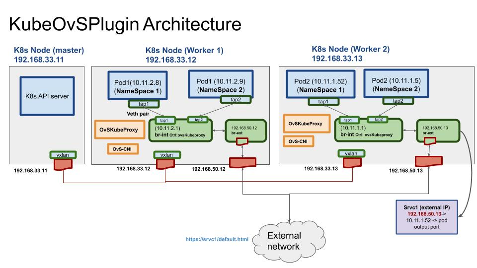

## KubeOvSPlugin

KubeOvSPlugin project aims to integrate Kubernetes networking with Open vSwitch OvS.

## KubeOvSPlugin Modules

**1- OvS CNI (ovsCNI)**

OvS CNI attaching k8s pods to the OvS bridge (br-int) that is created in k8s worker nodes.
OvS CNI assigns IP-address to the pods based on the IPAM definition at the CNI conf file.
OvS CNI creates br-ext to route the traffic between services/pods and external traffic. The external IP-Address
should be assigned to the k8s worker nodes.

**2- OvS KubeProxy (ovsKubeProxy)**

OvS KubeProxy setting up L2 & L3 networking on the k8s cluster. OvS KubeProxy leverages Openflow flow rules to setup e2e communications between pods, services and external networks.

## KubeOvSPlugin deployment diagrams

**KubeOvSPlugin Architecture:**
 
