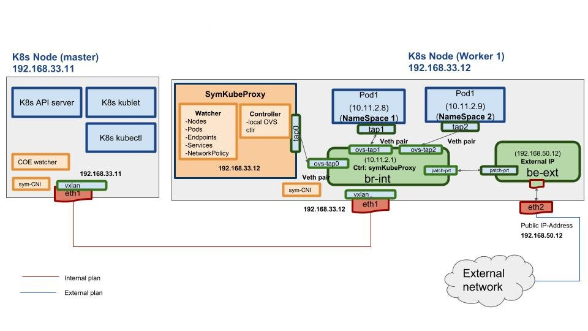
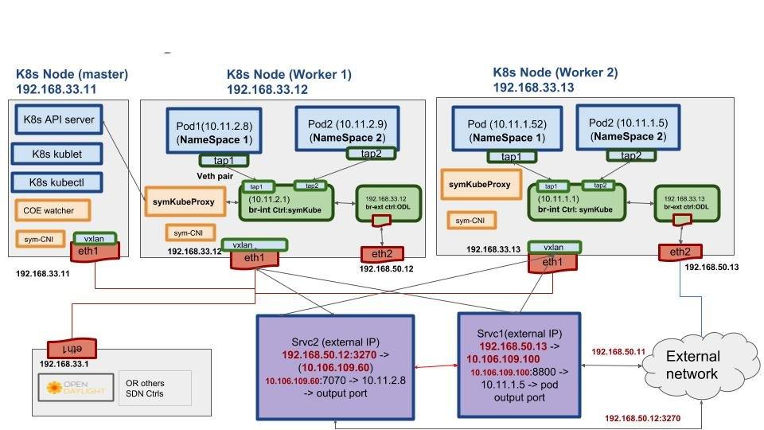
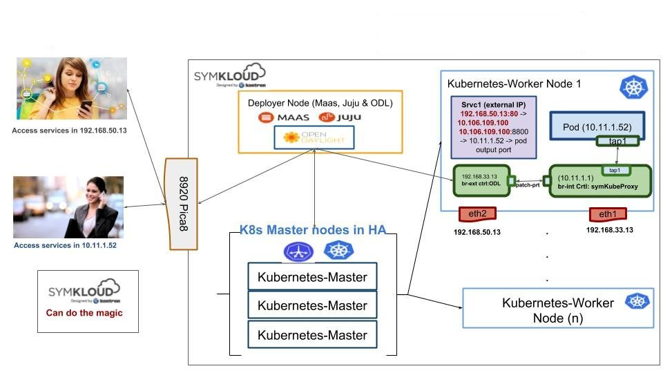

## Container Orchestration Engine (COE)

COE(Container orchestration Engine) project aims to develop a framework to integrate Container Orchestration Engines (like Kubernetes) with Open vSwitch OvS on the Symkloud.
Currently we deploy kubernetes on Symkloud using Flannel and Canal as default networking plugin. That limits Symkloud to scale the number of deployed containers on its nodes. COE framework will use OvS as networking plugin for Kubernetes to unlock Symkloud capabilities to scale and attach resources.

## COE Modules

The framework will be consist of 2 modules

1- Symkloud CNI.
2- Symkloud KubeProxy.

**1- Symkloud CNI (Sym-CNI)**

Sym-CNI (Container Network Interface) is responsible for attaching a pod to the OvS bridge that is installed on k8s nodes. The Sym-CNI creates port for each pod and assign pod IP-address.

**2- Symkloud KubeProxy (Sym-KubeProxy)**

Sym-KubeProxy is responsible for setting up Pods L2 & L3 networking. Sym-KubeProxy leverages OvS flow rules to allow the end 2 end communications between pods, services and external communication.

## COE deployment diagrams

**COE Architecture:**
COE modules
 

 
**COE Integration:**
COE can easily intgrate with other SDN controllers that manage the underlying network elements
 

 
 
**COE and Symkloud deployment:**
 (Edge Computing Use-Case) Integrate Opendaylight with COE deployment on Symkloud to simulate an edge computing use case that provide services to diferent type of consumers 
 
